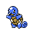
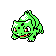

<div align="center">

<a href="https://neveux.me">
  
</a>

</div>

##  `> whoami`

**Staff Engineer** at [CloudBees](https://www.cloudbees.com/). I love code and how it's written.

I write **shell scripts**, **Jenkins plugins**, **Quarkus apps**, and **CI/CD pipelines** for a living. Over a decade of messing around with functional programming, infra as code, TDD, clean code, and whatever funny language comes from tall grass.

I'm super into tools, automation, ricing environments, Linux, CLIs, terminal. Basically anything that makes the machine do things properly.

I believe in well organized code bases, proper docs, and slick developer experience. Not the "there was a README we forgot to commit 2 years ago" kind.

##  `> cat interests.txt`

- **Coding**, Linux, terminal tooling (obviously)
- **Reading** (don't hesitate to ask me about books, I love talking about that)
- **Writing** (fun fact: I wrote a book)
- **Drawing**
- **Music** (played for years, nowadays more of a listening addict)
- **Sport** (gym, bike)
- **Fidget toys**
- **Pokémons**

Basically anything that keeps the brain busy.

##  `> cat /etc/causes`

I volunteer at **[SOS Tortues Bretagne](https://www.sostortuebretagne.com/)**, a tortoise rescue and conservation association in Brittany, France. They take care of aquatic and land tortoises (not sea turtles, the distinction matters).

I'm also working on a tortoise magazine: **[cheloniens.org](https://cheloniens.org/)**.

Tortoises have been around for 200 million years. The least we can do is help them survive us.

##  `> spawn_ --latest`

<!-- BLOG-POST-LIST:START -->
- [`My First Project Is My Environment`](https://blog.neveux.me/posts/my-first-project-is-my-environment/) — 2026-00-10<!-- BLOG-POST-LIST:END -->

##  `> echo $LINKS`

[](https://blog.neveux.me)
[](https://neveux.me)
[](https://www.linkedin.com/in/aneveux)
[](https://www.sostortuebretagne.com/)
[](https://cheloniens.org/)

---

<div align="center">

```
ʕノ•ᴥ•ʔノ ︵ ┻━┻
```

<sub>gen:∞ | pop:growing | state:alive</sub>

<sub>Pokémon sprites from [PokémonDB](https://pokemondb.net/sprites) · Palette: [Catppuccin Mocha](https://github.com/catppuccin/catppuccin)</sub>

</div>
